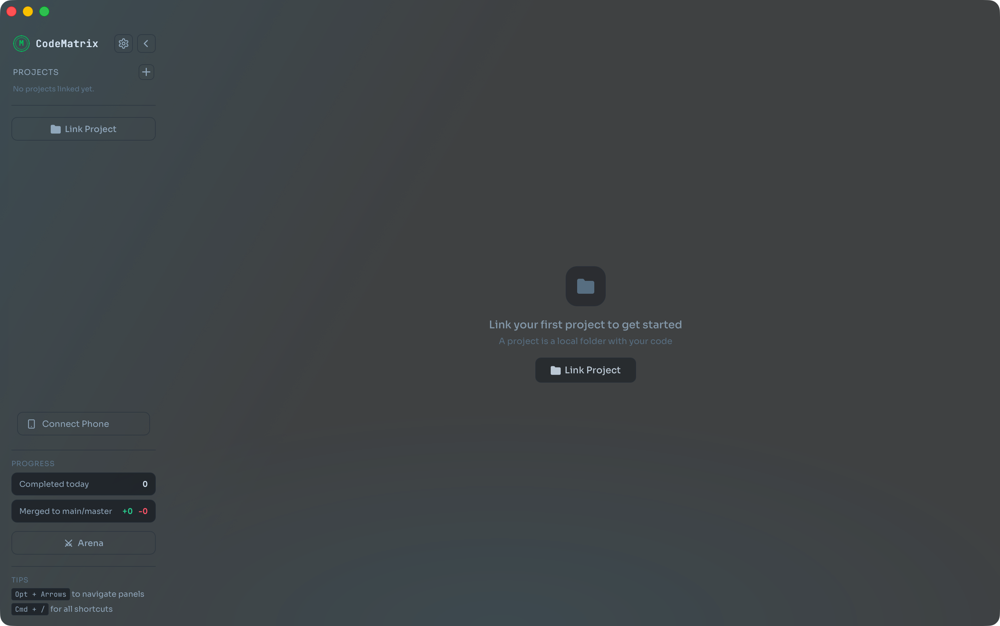

<h1 align="center">CodeMatrix</h1>

<p align="center">
  Run multiple AI coding agents without the chaos.
</p>

<p align="center">
  
  
  
  
</p>

**CodeMatrix** gives Claude Code, Codex CLI, and Gemini CLI each their own git branch and worktree — automatically. No agents stepping on each other's code, no juggling terminals, no mental overhead. Just one clean interface where you can see everything, navigate fast, merge results when they're ready — and monitor it all from your phone.

<p align="center">
  
</p>

## Why CodeMatrix?

Running multiple AI coding agents is powerful — but chaotic. On the same branch, agents interfere with each other's code. Across terminals, you lose track of what's happening where. Setting up feature branches and worktrees manually works, but adds cognitive load you shouldn't have to deal with.

CodeMatrix combines a dedicated GUI, automatic worktree isolation, and multi-agent orchestration into one app — so you can dispatch five tasks and walk away.

## How It Works

When you create a task, CodeMatrix:

1. Creates a new git branch from your main branch
2. Sets up a [git worktree](https://git-scm.com/docs/git-worktree) so the agent works in a separate directory
3. Symlinks `node_modules` and other gitignored directories into the worktree
4. Spawns the AI agent in that worktree

Five agents working on five different features at the same time, all from the same repo, with zero conflicts. Merge the branch back to main when you're done.

## Features

- **Multi-agent support** — Claude Code, Codex CLI, Gemini CLI and custom agents
- **Git isolation** — every task gets its own branch and worktree automatically
- **Tiled panel layout** — see all tasks at once, drag to reorder
- **Built-in diff viewer** — review changed files per task before merging
- **Arena mode** — pit multiple agents against each other on the same prompt, compare results
- **Remote access** — scan a QR code to monitor agents from your phone over Wi-Fi or Tailscale
- **Keyboard-first** — every action has a shortcut, `Ctrl+/` shows them all
- **Shell terminals** — per-task shells scoped to the worktree
- **Direct mode** — work on the main branch without isolation when needed
- **Themes** — Minimal, Graphite, Classic, Indigo, Ember, Glacier, Glass (transparent, macOS)
- **State persistence** — picks up right where you left off across restarts
- **macOS and Linux**

## Getting Started

### Download

Download the latest release for your platform:

- **macOS** — `.dmg` (universal)
- **Linux** — `.AppImage` or `.deb`

### Prerequisites

Install at least one AI coding CLI:

- [Claude Code](https://docs.anthropic.com/en/docs/claude-code)
- [Codex CLI](https://github.com/openai/codex)
- [Gemini CLI](https://github.com/google-gemini/gemini-cli)

### Build from Source

```sh
git clone https://github.com/YOUR_USERNAME/CodeMatrix.git
cd CodeMatrix
npm install
npm run tauri:dev
```

Requires [Node.js](https://nodejs.org/) v18+ and [Rust](https://rustup.rs/) stable toolchain.

## Keyboard Shortcuts

`Ctrl` = `Cmd` on macOS.

| Shortcut        | Action                  |
| --------------- | ----------------------- |
| `Ctrl+N`        | New task                |
| `Ctrl+Enter`    | Send prompt             |
| `Ctrl+Shift+M`  | Merge task to main      |
| `Ctrl+Shift+P`  | Push to remote          |
| `Ctrl+W`        | Close focused terminal  |
| `Ctrl+Shift+W`  | Close active task       |
| `Alt+Arrows`    | Navigate between panels |
| `Ctrl+B`        | Toggle sidebar          |
| `Ctrl+Shift+T`  | New shell terminal      |
| `Ctrl+,`        | Settings                |
| `Ctrl+/` / `F1` | Show all shortcuts      |

## Acknowledgments

This project is based on [Parallel Code](https://github.com/johannesjo/parallel-code) by johannesjo, licensed under the [MIT License](https://github.com/johannesjo/parallel-code/blob/main/LICENSE).

## License

MIT
